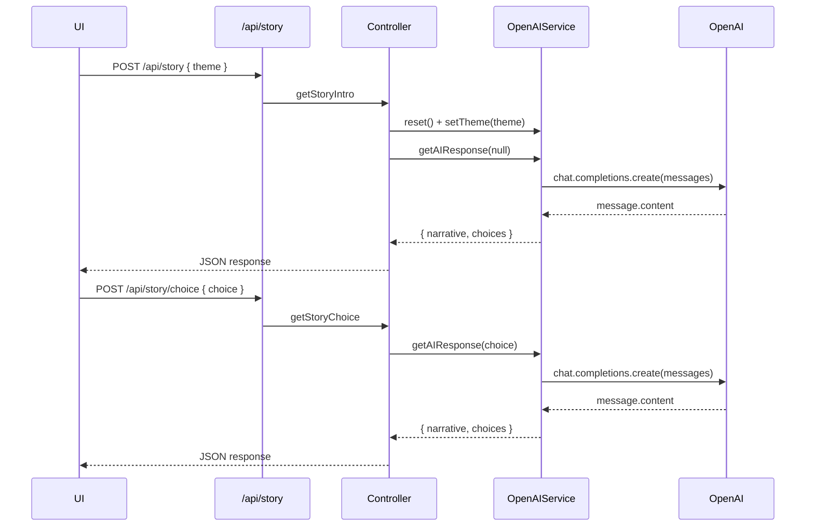

# LLM Architecture

This document explains the structure and patterns used in `src/llm/` and how to extend them.

## Design Patterns

- Strategy: `StoryType` defines the strategy interface for shaping the LLM role and user prompts. `ShortStory` is a concrete strategy that stages the narrative over multiple turns.
- Template Method (hook): `StoryType.themeIntro()` is a reusable template segment that concrete strategies build upon.
- Facade: `OpenAIService` wraps OpenAI client usage, request/response shaping, basic session history, and parsing into a single, simple API.
- Lightweight State: `ShortStory` tracks turn count (`numberOfChoicesSoFar`) to progress story beats.

## Flow Overview

1. Client calls POST `/api/story` with `{ theme }`.
2. `OpenAIService.reset()` clears prior state; `setTheme(theme)` composes the system prompt using the active `StoryType`.
3. `OpenAIService.getAIResponse()` constructs messages and calls the OpenAI Chat Completions API.
4. The LLM is instructed to return a strict format:
   - `RESPONSE: ...` (narrative)
   - `CHOICES:` followed by four numbered lines
5. `OpenAIService` parses model output into `{ narrative, choices }` and appends to session history.
6. Client sends subsequent choices to POST `/api/story/choice` with `{ choice }` to continue the story.

## Sequence (Mermaid)



## Class Diagram (Mermaid)

```mermaid
classDiagram
  class StoryType {
    <<abstract>>
    - numberOfChoicesSoFar: number
    - numberOfSentencesPerResponse: number
    + getLLMRole(theme: string): string
    + getUserPrompt(choice: string): string
    + reset(): void
    # themeIntro(): string
  }

  class ShortStory {
    + getLLMRole(theme: string): string
    + getUserPrompt(choice: string): string
    + reset(): void
  }

  class OpenAIService {
    - apiKey: string
    - model: string
    - client: OpenAI
    - storyTellerRole: string
    - history: string[][]
    - introMessage: string
    - storyType: StoryType
    + reset(): void
    + setTheme(theme: string): void
    + getAIResponse(choice?: string): Promise<{ narrative, choices }>
  }

  StoryType <|-- ShortStory
  OpenAIService o-- StoryType
```

## Response Contract

The model is prompted to return content in this structure:

```
RESPONSE: <narrative text>
CHOICES:
1. <choice 1>
2. <choice 2>
3. <choice 3>
4. <choice 4>
```

The parser is tolerant but expects both sections to exist. If parsing fails, a default narrative/choices set is returned.

## Adding a New StoryType

1. Create a new class `MyStoryType` that extends `StoryType`.
2. Implement:
   - `getLLMRole(theme)`: build a system prompt (re-use `themeIntro()` and add your constraints).
   - `getUserPrompt(choice)`: stage the narrative beats; increment internal counters as needed.
   - `reset()`: clear state such as counters.
3. Wire it into `OpenAIService` by instantiating your type where `ShortStory` is used.
4. Ensure your role instructions keep the RESPONSE/CHOICES output format.

Example skeleton:

```ts
export class MyStoryType extends StoryType {
  protected numberOfChoicesSoFar = 0;
  protected numberOfSentencesPerResponse = 7;

  getLLMRole(theme: string): string {
    return `${this.themeIntro()}\nTheme: ${theme}\n...`;
  }

  getUserPrompt(choice: string): string {
    this.numberOfChoicesSoFar++;
    // Return a staged instruction based on turn
    return `MESSAGE NUMBER: ${this.numberOfChoicesSoFar}\nTHE CHOICE: ${choice}\nACTION: ...`;
  }

  reset(): void {
    this.numberOfChoicesSoFar = 0;
  }
}
```

## Operational Notes

- Model: default is `gpt-3.5-turbo`; adjust in `OpenAIService` if needed.
- Tokens/creativity: governed by `MAX_TOKENS` and `TEMPERATURE` environment variables.
- History: minimal `{ user, assistant }` pairs are kept to provide context across turns.
